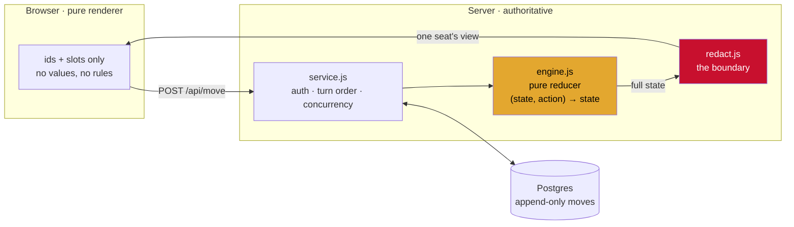

# 🐝 The Bee's House

**Cabo, played one move at a time, across two days, by five people who are never free at once.**
**Link: https://bee-house.vercel.app/**

Five friends, one card game, and the standing joke
that Hrutik has been asking to play Cabo for almost forever and the group has been
saying no for almost forever. So the game came to them: no scheduling, no video call,
a link in the group chat and eleven seconds of your attention.

> **Disclaimer.** All animals were assigned by Hrutik. No appeals were heard.

```
9,291 lines · 14 API routes · 14 node suites · 7 browser suites · 0 frameworks
```

---

## The one idea worth stealing

A card game is an information problem wearing a costume. Cabo is *entirely*
about who knows which cards, so the whole build reduces to one question:

> Can the client ever learn something it did not earn?

The answer is architectural, not defensive. **The client holds nothing.** It has
no cards, runs no rules, and decides nothing. It is a renderer pointed at a
redacted projection of state it is never given.



Everything interesting hangs off that red box.

---


### 1. The engine is a pure reducer, so it can be fuzzed

`lib/engine.js` is `(state, action) → state`. No DOM, no clock, no I/O, no
`Date.now()`. The identical file runs in Node and in the browser.

That purity buys the single highest-value test in the repo: **4,000 randomised
complete matches per run**, asserting no crash, no stall, no duplicate or
out-of-range card, and exact settlement arithmetic. It also measures a design
question I could not answer by reasoning: how often the social scoring
mechanic actually changes the winner.

```
matches: 4000/4000   crashes: 0   stalled: 0   settlement errors: 0
Tab changed the winner in 343 matches (8.6%)
```

8.6% was the target zone. Enough to matter, not enough to take over. That
number is a *design* result, produced by a test.

### 2. Cards do not know their own value

```js
// A card is {id, r, s}. There is deliberately no `v`.
function valueOf(card) {
  switch (card.r) {
    case 'A': return 1;
    case 'J': return 11;
    case 'Q': return 12;
    case 'K': return isRed(card) ? -1 : 13;   // the whole game, in one line
    default:  return Number(card.r);
  }
}
```

Value is computed, never stored. A card therefore **cannot leak its score
through careless serialisation.** There is no field to forget to strip. The
red king at −1 and the black king at 13 are visually identical apart from suit,
which is exactly the trap: everyone assumes a king is high.

### 3. Redaction is a boundary, and the test that guards it is proven to fail

`redact.js` takes full state and returns one seat's view. Your own hand comes
back as ids and slots with no values. So does everyone else's.

The test builds **every seat's view at every state of hundreds of matches** and
asserts nothing unearned appears:

```
views checked: 358,175
unearned values exposed: 0
own-hand values exposed: 0
reveals surviving into GET /state: 0
```

A leak detector that has never caught anything is decoration. So it gets
sabotaged: deliberately expose your own hand, an opponent's hand, the draw
pile, a suit without a rank. Each must fail loudly with the offending path.
**Every security check in this repo has been broken on purpose to prove it
notices.** That discipline caught a real one: the original detector looked only
for `v`, and would have missed a leak that shipped `{id, s}`.

### 4. A revealed card is a one-shot envelope

A card you earn sight of comes back **exactly once**, in a separate `reveal`
field on the response to the move that earned it. `GET /api/state` never carries
a reveal.

Which means **refreshing the page cannot re-show you a card.** The memory rule
of the physical game survives going online for free, as a consequence of the
transport rather than as a rule anyone has to enforce.

### 5. Append-only log as the single source of derived truth

One `moves` table, never updated, never deleted. The Tab, the turn briefing,
the end-of-match recap, the replay, and the season standings are all *queries
over that one table*.

They therefore cannot disagree with what happened, or with each other. There is
no second place where "what occurred" is written down, so there is no
reconciliation bug available to write.

The turn clock is the nicest consequence. "How long has this turn been sitting?"
is not a stored timer. It is:

> the timestamp of the last move made by **somebody other than** the player whose
> turn it is.

Not their own last move. A player who draws a card and vanishes for two days has
still held the game for two days, and reading it this way means **the clock
cannot be wound back by touching the game.**

### 6. Optimistic concurrency, because five phones

Every round row carries a `version`. Moves send `expectedVersion`; a mismatch is
a `409` carrying the current version, and the client re-reads. No locks, no
transactions held across a user's thinking time, and correct under the actual
failure mode: two people opening the link at the same moment.

### 7. Two storage adapters, one conformance suite

`memory` (tests) and `pg` (production) sit behind one interface and are run
through **the same test file**. This is not ceremony. It has caught two real
bugs that in-memory storage hid completely:

| Bug | Why memory hid it |
|---|---|
| `scores.player_id` is a UUID FK, and the code passed the animal string `'bee'` | JS objects do not typecheck |
| `appendMoves` silently dropped a supplied `created_at` on Postgres but honoured it in memory | Nothing in the app passes one, so the divergence was invisible until the turn clock needed to be tested |

The second is the interesting one: not a live bug, but two adapters that
quietly disagreed. That is how a live bug gets born. Both now behave
identically, and the conformance suite asserts it.

There is also a **compounding** bug worth naming: player rows are per-game, so
aggregating season standings by `player_id` would have listed each person once
per match. The animal is what identifies a person *across* matches. Only
Postgres could surface it.

### 8. The client cannot run the reducer, so animation is a diff

Strict redaction has a consequence people miss: **the client cannot simulate.**
There is no optimistic UI. It gets a new view and paints it, and nothing in that
loop knows a card *moved*, only that the screen looks different.

You cannot animate a difference you never computed. So:

```
diff(prevView, nextView)  →  "c31 went from Sahil's slot 2 to the discard"
       ↓
FLIP: measure → repaint → invert → release
```

The client keeps the previous view, diffs by stable card id, and uses FLIP
(First-Last-Invert-Play) so cards glide between two layouts with nobody
hand-writing coordinates. It survives any screen size and degrades to nothing
under `prefers-reduced-motion`.

The same machinery gives the **catch-up replay**: your phone parks the last
table you saw in `localStorage`, and on returning after a day away it paints
the *old* table first, then releases. Every card that changed hands while you
were gone glides into place while you watch. Play is blocked during it, because
the board on screen is briefly a lie.

**The edge case that made this real:** it originally animated nothing, because
only the two piles carried a `data-card` id. Hands had none, so cards moving
into or out of a hand teleported. Sixteen opponent cards and your own four were
invisible to the diff.

### 9. Deterministic message generation

218 lines of copy across five personas and four situations, written in the voice
of whoever is sending:

```
Sharayu  Played. Hrutik, go. Nothing landed on me, by the way.
Shivani  Hrutik you are up. Good luck with your notes.
Sahil    Done. Hrutik, and be quick about it.
Roshan   Something happened. Nobody heard what. Hrutik, go.
```

The pick is a **hash of (room, round, version)**, not `Math.random()`. Same turn,
same line, always, so nobody can refresh hunting for a funnier one. And nudges
escalate: past twenty four hours the turn clock switches to a different set
entirely, because a nudge at hour two and a nudge at hour thirty are different
messages.

### 10. Polling that respects a free tier

Turns arrive on their own, but five phones left open overnight must not hammer a
free Neon instance until morning.

- Hidden tab: **zero requests.** Asserted by a test that counts network calls
  over twelve seconds with visibility faked to `hidden`.
- Visible and active: 5s
- Nothing has changed for a minute: 15s, then 45s
- Focus or visibility change: resets to attentive

And a poll that finds nothing new **does not call `setState`**, compared by a
computed signature, so a background check can never repaint the board while
somebody is halfway through typing a note.

---

## Edge cases that were found the hard way

Each of these was a real failure, and each has a test now.

| | What broke | The fix |
|---|---|---|
| **Deck exhaustion** | Reshuffling the discard crashed when it held fewer than 2 cards | Guard, and the round ends rather than deadlocking |
| **Empty hand** | Slapping all four cards left a player with nothing and no exit | Round ends, that player scores 0 |
| **Lobby deadlock** | A 5-seat room with 2 claimed sat in the peek phase forever | Lobby gate, and later: everyone confirms ready |
| **Half-open turn** | Modals could dead-end with a thin deck or too few opponents | Guards plus a "never mind" on every branch |
| **`POSTGRES_URL` vs `DATABASE_URL`** | Vercel injects the former. Serverless would have silently used in-memory storage, forgetting every game between requests | Accept both, and shout on boot if neither is present in production |
| **`REVOKE ... FROM anon`** | A Supabase-ism. The role does not exist on Neon, and Postgres aborts the entire script | Conditional on `pg_roles` |
| **Cache** | Only `/api/*` was `no-store`. Deploys were invisible for a day | `no-store` on the page, `?v=<build>` on every asset, and a build stamp in the rule book so "am I on the new one" is a five-second question |
| **Listen desync** | The client sent a question *index* while displaying a stale list, so you were truthfully answered a question you did not ask | The list ships with the game state |
| **Peek loophole** | Unlimited re-looks before the round starts, added for kindness, let you look at slots 1+2 then 3+4 and learn your whole hand | The chosen pair is locked; asking for the other two returns your original two |

---

## Testing philosophy: break it on purpose

A test that has never failed is a hypothesis, not a test. So every gate in this
repo has been deliberately broken to watch the suite notice:

- Redaction, 5 kinds of planted leak, including a suit-only one the original
  detector would have missed
- The replay gate, served mid-round, which would hand out live card positions
- The 48-hour skip, both the time gate and the "cannot skip yourself" rule
- Seat recovery, self-approval, double-decision, and a denial that moved the seat anyway
- The peek pair lock, returning whatever the client asked for
- Private notes, a planted request containing the note text

The tests also caught **their own** false positives, which is the part nobody
writes down:

- A king test matched `"13"` inside a `scale()` transform
- A "the two red kings render identically" assertion that was simply wrong.
  Hearts and diamonds are different shapes
- A card-value check that failed only when the card was a **10**, because `"10"`
  contains no character in `[AJQK2-9]`
- A test that passed 3 runs in 4 because it depended on the shuffle. Seeded.
  *A test that passes most of the time is worse than no test: it trains you to
  re-run it.*

---

## Product decisions with engineering consequences

**Private notes.** You may write a note under your own card. It never leaves the
phone, proven by recording every request the page makes and searching all of
them for the text. The reasoning: the physical game cannot stop you writing on a
napkin, so enforcing memory in software is fake difficulty. But it made the
unlimited-re-look feature safe to add, since the information was already
obtainable.

**Aiming on the table, not in menus.** Powers used to be two screens of lists
with the table hidden behind them. Now legal targets pulse and you tap the card
you mean. Safe because card ids are already stable in every view: a determined
player could always track provenance, and in the physical game you *watch* the
swap happen. You just never see the face.

**Seat recovery is social.** Clear your browser and there is no password to
reset, because there is no password. So: the new device asks, the request
appears on everyone else's screen, and any other player approves. Four people
already know whether Sahil is Sahil. That is both the simplest implementation
and the correct answer.

**Nothing is ever deleted.** `moves` is append-only, seat requests keep their
whole history including denials, and every round of every match is written to
`scores` even when the Tab settles per match.

---

## Running it

```bash
npm install
npm run dev            # localhost:3000, in-memory, wiped on restart
npm test               # 14 node suites
npm run test:browser   # 7 Playwright suites, each boots its own server
```

Against a real database:

```bash
DATABASE_URL="postgresql://..." npm test
```

The two-adapter suites detect `DATABASE_URL` and run **twice**, once per
backend. Skipping that is how the UUID bug survived a week.

### Deploying

```bash
npx vercel link
npx vercel env pull .env.local --environment=production   # note the flag
node setup-db.js                                          # idempotent
npx vercel --prod                                         # --prod, or it lands behind a login wall
```

`schema.sql` is safe to re-run: every table, index and grant is `if not exists`
or conditional. The Phase 2 `seasons` table was added as a migration over a live
database without touching anything in it.

---

## Layout

```
lib/engine.js     the rules. Pure. Runs identically in Node and the browser.
lib/redact.js     the security boundary. Full state in, one seat's view out.
lib/db.js         storage. memory | postgres behind one interface.
lib/service.js    auth, turn order, concurrency, clock, recap, seasons.
lib/voices.js     218 lines of copy in five voices. Pure data.
api/*.js          fourteen thin HTTP wrappers. Three lines each.
public/           the client. A renderer and nothing else.
  cards.js        all 52 faces drawn as SVG at render time. No images.
  anim.js         the view diff and FLIP.
schema.sql        six tables. Row-level security on, zero policies.
```

**No build step.** React 18 UMD from a CDN plus element factories. No bundler,
no JSX transform, no `node_modules` in the deploy. The client is three script
tags and a stylesheet.

**No images.** All 52 card faces are generated as SVG in code, with classic pip
layouts and the bottom half rotated 180° like a real card. Nothing to load,
nothing to 404, crisp at any size.

---

*Nobody has to be online at the same time. You get a link in the group, you open
it, you play in eleven seconds, you close it. A round takes about two days.*

*The house never remembers a card for you. That is not a missing feature.*
